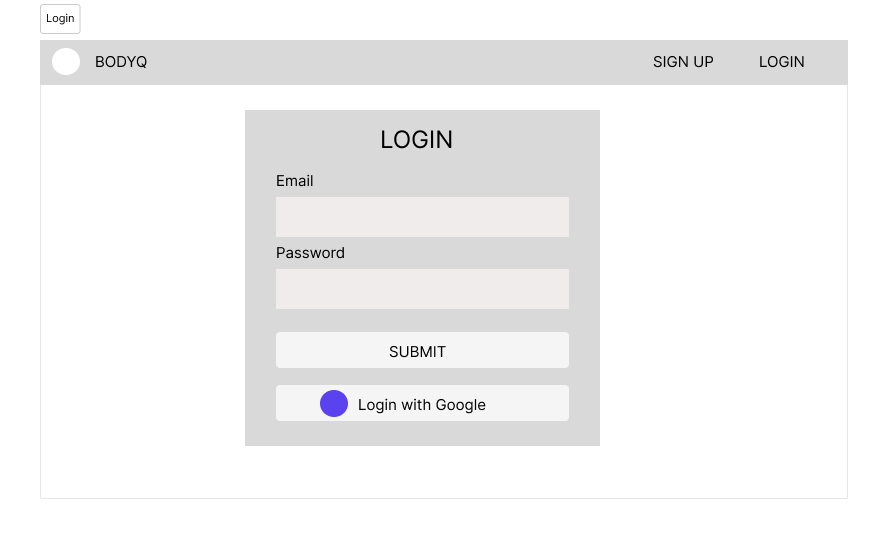
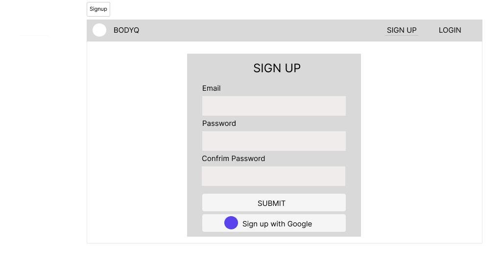
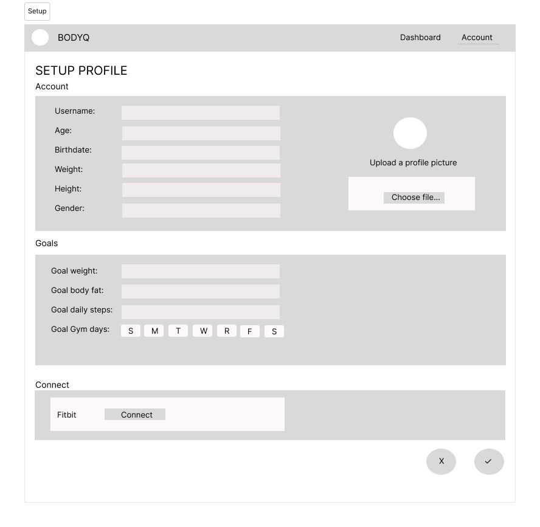
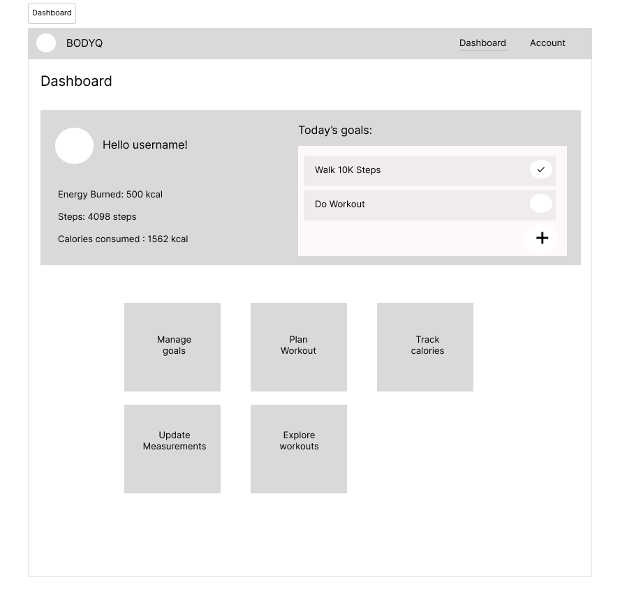

# Project Title

BodyQ

## Overview

"Body Quotient", similar to IQ or EQ. It could signify an individual's overall fitness and health score, incorporating metrics like body composition, strength, flexibility, and endurance. This app promotes comprehensive body awareness and progress, with users striving to boost their BodyQ as they improve their fitness, diet, and health habits.

### User Profile

### Features

- As a user, I want to be able to login into an account
- As a user, I want to be able to login into an account using my google account
- As a user, I want to be able to create a new account
- As a user, I want to be able to create a new account using my google account

- As a logged in user, I want to be able to set up my account details and starter goals
- As a logged in user, I want to be able to connect with my fitbit account
- As a logged in user, I want to be see my goals for today and and check them off as I finish them
- As a logged in user, I want to add, edit and delete goals
- As a logged in user, I want to plan my wwekly workouts
- As a logged in user, I want to input and track my calories for the day
- As a logged in user, I want to show analytics of my progress made
- As a logged in user, I want to browse workouts for specific muscle group
- As a logged in user, I want to track my progress by updating my body measurements

## Implementation

### Tech Stack

- React
- JavaScript
- MySQL
- Express
- Client libraries:
  - react
  - react router
  - axios
  - react chartJS
- Server libraries:
  - knex
  - express
  - bcrypt for password sharing
  - OAuth for authentication
- Deployment:
  - Netlify for Frontend
  - Heroku for Backend

### APIs

- Fitbit Web API Explorer
- API ninjas: Nutrition API
- API ninjas: Exercises API

### Sitemap

- Login
- SignUp
- Dashboard
- Manage goals
- Account Details
- Plan Workout
- Track Calories
- Show Analytics
- Explore Workouts
- Update Measurements
- Setup

### Mockups

#### Login Page

#### SignUp Page

#### Setup Page

#### Dashboard

#### Manage goals

#### Account Details

#### Plan Workout

#### Track Calories

#### Show Analytics

#### Explore Workouts

#### Update Measurements

## Data

### Endpoints

### Auth

## Roadmap

- Create client
  - react project

## Nice-to-haves

- Allow adding google calendar events/reminders on google calendar
- Sync with google account
- Progress tracker: Ability to store before and after images
- Ability to take a picture and an internal algorightm will identify the foods in the picture and input the calories
- Gamify the app by adding weekly challenges and the users will have to compete to be shown in the weekly leaderboard. Points were awarded by completing certain tasks.
- Ability for users to follow and interact with each other's activity by commenting and liking their posts
- Sync and connect with other health apps like Apple health App, Fitbit, Strava and integration with more wearables like Apple watch
- Enable post sharing cross platforms like IG and twitter
- Unit and Integration Tests
- Weekly and monthly reports
- Show workout analytics and AI workout recommendations
- Progressive overload planner which adjust workout intensity, reps, and weight based on progress and feedback to ensure constant improvement. In addition, suggests when to increase difficulty based on your logged workouts.
- Have a BodyQ score algorithm: a comprehensive score based on your fitness metrics (e.g., body fat percentage, muscle mass, flexibility, strength).
